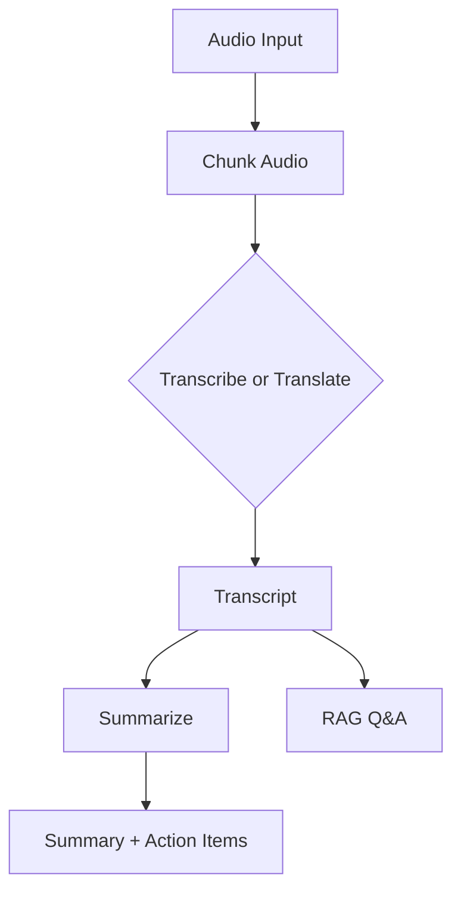

# AI Meeting Assistant

Turn raw meeting audio into clean transcripts, concise summaries, action items, and a searchable Q&A experience. This project records system audio or accepts an existing audio file, sends it to Groq for transcription/translation, summarizes with Mistral, and enables retrieval-augmented Q&A over the transcript.

## Highlights

- Record system audio (Windows WASAPI loopback) or use an existing audio file
- Manual stop recording by pressing q
- Chunk and transcribe with Groq (fast, reliable)
- Optional audio to English translation
- Smart summaries, action items, decisions, and open questions
- RAG Q&A over the transcript with Mistral + sentence-transformers
- Auto-cleanup: recordings folder is deleted after a run

## Project Flow



## Requirements

- Windows is required for system audio recording via WASAPI loopback
- Python 3.12+
- ffmpeg installed and on PATH (required by pydub)
- Groq API key for transcription and translation
- Mistral API key for summarization and RAG

## Setup

1. Create and activate a virtual environment

```bash
python -m venv .venv
.venv\Scripts\activate
```

1. Install dependencies

```bash
pip install -r requirements.txt
```

1. Create a .env file in the project root

```env
GROQ_API_KEY=your_groq_key_here
MISTRAL_API_KEY=your_mistral_key_here
```

## Usage

Run the app from the project root:

```bash
python main.py
```

The CLI will guide you through:

- Record system audio now? If yes, press Enter to start and press q to stop.
- Chunk size in minutes
- Choose transcribe or translate to English
- Summarization (optional)
- RAG Q&A (optional)

## Outputs

The following files are generated in the project root:

- transcript_original.txt (transcription)
- translation_english.txt (translation mode only)
- combined_partial_summaries.txt
- full_summary.txt
- action_items.txt
- key_decisions.txt
- open_questions.txt

Note: The recordings folder is deleted after the run finishes. If you want to keep audio chunks, remove the cleanup block in main.

## Troubleshooting

- No audio captured: make sure system audio is playing and your default speaker is set correctly.
- ffmpeg errors: install ffmpeg and ensure it is available on PATH.
- Empty transcript: confirm your Groq API key is valid and audio is not silent.
- RAG Q&A answers seem unrelated: try smaller chunk size or ask more specific questions.

## Project Structure

```
main.py
requirements.txt
pyproject.toml
src/
 audio_splitter.py
 audio_transcriber.py
 audio_translator.py
 meeting_audio_processor.py
 meeting_summarizer.py
 rag_pipeline.py
```

